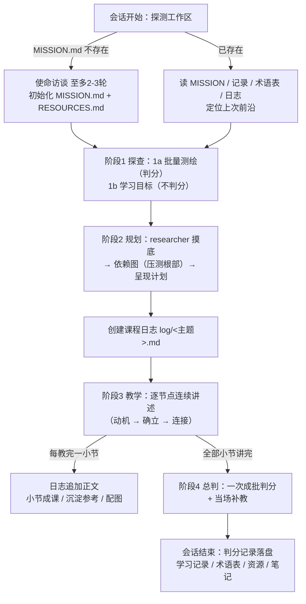

# Learning Skill 介绍——系统性教学工作区全景

> 一套面向 Claude Code 的中文教学系统：把一个主题**教到真正被理解**——事实能从已接受的地基硎中推导出来、连接进心智模型——而不是死记硬背。核心理念：**理解 > 记忆**，教学的一切动作都是为了让学习者的脑中长出一张**依赖图**（少数核心真理在根部，其余事实挂在上面推导得出）。

本文回答三个问题：**这套系统的流程是什么样子的**、**它会在什么阶段生成哪些文档**、**每个文档长什么样、承担什么角色**。

---

## 1. 仓库构成

| 路径 | 角色 |
|------|------|
| `skills/learning/SKILL.md` | 教学系统主体——哲学、流程、quiz 协议、工作区约定 |
| `skills/learning/assets/TEMPLATE.html` | 课程模板——三栏课程页（左=计划小节导航，中=正文，右=本节大纲） |
| `skills/learning/assets/template-布局.md` | 模板布局分析——三栏公式、设计令牌、响应式行为 |
| `skills/learning/references/*-FORMAT.md` | 四份文档格式规范：使命 / 资源 / 学习记录 / 术语表 |
| `skills/visualize/` + `agents/diagram-maker.md` | 配图链：教师出 brief → maker 渲染 PNG 并亲眼验证 |
| `agents/researcher.md` | 网络调研员：课前摸底、事实核实，产出带出处的简报 |
| `skills/browser-act/` `skills/diagram-design/` `skills/obsidian-markdown/` | 协同技能：浏览器演示、正式图示、Obsidian 格式约定 |

---

## 2. 设计哲学（系统为什么这样教）

- **连接的知识 > 割裂的知识**：两个脑可以持有同样的命题，一个是孤立散点，一个是少数核心真理加推导——后者才是理解。教学的目标体感是 **the click**：一堆孤立事实坍缩成几条生成性想法的瞬间。
- **原则 i——无条件的真理优先**：先锁定少数几条可照字面接受、无附带条件、不会被更根本的东西推翻的硬事实，其余一切显式地构建在它们之上。术语上区分*无条件真理*（持有方式上的属性）与*公理*（图中无入边的根节点），不滥用"公理"。
- **原则 ii——"我怎么可能自己发现这个？"**：显得武断的事实锁不住。每个事实都带着动机走一遍发现之路——为什么做这件事、为什么试这个方法、什么会让人想到这条路。默认**讲述式**（3Blue1Brown 风格连续叙述，零打断）；学习者点名"让我自己推"才切 Socratic 问答式。
- **流利强度 vs 存储强度**：临场流利会给虚假的掌握感，长期保持才是目标。会话末总判只是及格线；技能类主题用合意困难（提取练习、间隔、交错）建立存储强度。
- **知识 vs 技能**：知识类主题（如理论物理）困难是敌人，讲平顺；技能类主题（如编程）困难是工具，用反馈循环教——反馈越紧越好。
- **最近发展区**：教"已确立地板与目标天花板之间、且最相关"的东西——跨会话由学习记录与日志判分记录读出，会话内由阶段 1 测绘夹出。

---

## 3. 触发分层

| 层 | 触发 | 行为 |
|----|------|------|
| **L1 解释** | 教学语境内的顺带讲解、答疑 | 只用两条原则 + 准确性核实，**不落任何文件** |
| **L2 教学会话** | "我想学 X""系统性学习 X""教我 X" | 完整四阶段流程 + 学习工作区全部产物 |

已有使命的工作区里，会话中途冒出的其他主题默认按 L1 处理（不污染本主题文件）；明确要**换**学习目标时走使命修订——新工作区初始化 `MISSION.md`，旧工作区写一条学习记录收束后原样保留。

---

## 4. 完整流程：探查 → 规划 → 教学 → 总判

四个阶段**永远按序全跑**；每个阶段缩放的是*规模*，绝不缩放*形状*。



### 会话开始——探测工作区（三选一）

- **新工作区**：`MISSION.md` 不存在 → 第一件事追问学习者为什么学（不判分访谈，至多 2-3 轮；给不出动机就如实写"动机暂缺"），随后初始化 `MISSION.md` 与 `RESOURCES.md`。工作区选址：空目录或专用学习目录就地使用；在代码仓库里触发则先确认目录，不往别人项目里倾倒文件。
- **续接**：读 `MISSION.md`、全部 `learning-records/`、`GLOSSARY.md`、`NOTES.md`、本主题 `log/` 日志——前沿 = 判分记录覆盖到的最后一个小节；讲了但总判未覆盖的悬空小节并入下次总判。
- **开场零提问**：不设开场复习——跨会话提取练习由会话末总判承担，开场直接进入探查或教学。

### 阶段 1——探查（绝不跳过）

- **1a 批量测绘（判分）**：至多两轮 `AskUserQuestion`（每轮至多 4 题、全程至多 8 题），沿课程主线递阶排布，定位理解的*边界*——答对的是地板，答错/真不会的是天花板，**边界只有被夹住才算定位**。全对则第二轮难度猛跳；错答种类不明则围绕错误下钻（误解优先探明范围）。空地板（全"不知道"且已到最基础概念）直接从无条件真理起教。
- **1b 学习目标（不判分）**："我想理解 LLM"可以指十种东西——把愿景追问到具体为止。只收集偏好，无对错。

### 阶段 2——规划（杠杆率最高的一步）

1. 先派 `researcher` 子代理摸底领域（核心概念、真正的第一性原理、常见坑）——既刷新把握，也把真正的无条件真理翻出来；不可用则自带搜索亲自摸底，**摸底不可省**。
2. 对着哲学设计依赖图：哪些无条件真理、学习者已持有哪些、有动机的发现路径、知识还是技能、反馈循环怎么搭。
3. **压测根部**：每个当作基础的节点问一遍"它真的是无条件真理，还是伪装的定理"——推得出来就压下去，不把课程奠基在半山腰。
4. 呈现计划：一段散文思路 + 一张小型 mermaid 依赖图（根=无条件真理，汇点=学习者目标）。**展示后不停留**——声明"有异议随时喊停"后直接开教，无阻塞审批点。

### 阶段 3——教学（连续讲述，零提问零打断）

一次一个**节点**构建依赖图；每 2-3 个节点构成一个**小节**（日志镜像与总判都以小节为单位）。每个节点三步：

1. **给动机**——为什么现在需要它、解决什么问题（无条件真理也不例外）；
2. **确立**——基础真理平直陈述；推导步骤走有动机的发现之路；
3. **连接**——把依赖边显式化，新节点挂在哪些已就位的节点上。

学习者中途插问就答，答完接着讲；发现自己正在断言一个只能靠信仰接受的事实时停下——要么补动机，要么奠基到已确立的东西上。

### 阶段 4——总判（会话末，一次成批）

- 覆盖全部小节，每节 1-2 题，塞进尽量少的调用；上次前沿的复习题、悬空小节的补判题一并掺入——间隔复习与悬空验证免费发生。
- 当场判分（✓/✗ + 正确答案 + 简短解释），答错的小节当场补教再出确认题钉住，不让会话在错误上结束。
- **判分记录落盘**：每题一行（题面 | 学习者回答 | 判定 | 缺口说明）追加进日志，下次会话据此续接并修补 lessons/reference。

### 会话结束——落盘清单

- 判分记录已落盘；时间不够跑总判时如实标注悬空小节（`> 进度：小节 X/Y，总判未跑`）；
- 满足条件写一条学习记录；有新术语立住就更新术语表（修订定义同步全工作区）；
- 高质量可信源沉淀进资源清单；学习者偏好记入记事本；会话内容镜像到课程日志。

---

## 5. 生成的文档全景（核心）

### 5.1 总表——什么阶段生成什么

工作区布局分两处：**`docs/` 子目录收纳状态管理类中间文件**；教学产物（GLOSSARY / log / lessons / reference / viz）留在工作区根，与产物三层一致。

| 文档 | 形态 | 首次生成时机 | 后续更新节奏 | 角色 |
|------|------|--------------|--------------|------|
| `docs/MISSION.md` | Markdown | **会话开始**：使命访谈（≤2-3 轮）后初始化 | 使命修订时（先与学习者确认）；换目标时在新工作区重建 | 锚——一切教学决策回溯到它 |
| `docs/RESOURCES.md` | Markdown | **会话开始**：与 MISSION 一起初始化 | 规划摸底、教学中核实的可信产出随时登记；会话末统一沉淀 | 情境知识支撑——越学越"知道去哪找" |
| `log/<主题slug>.md` | Markdown | **阶段 2**：计划呈现时创建 | 每教完一小节追加正文+进度标注；总判题面先落盘、作答后补答案；判分记录追加 | 过程——会话镜像，实时可读 |
| `lessons/0001-*.html` | HTML（三栏课程页） | **阶段 3**：教完小节判断去向时——有跨会话复习价值的整节成课 | **快照不回填**——新课程发布不刷新旧文件 | 复习——自包含可复习单元 |
| `reference/*.md` | Markdown | **阶段 3**：与课程同时沉淀 | 据判分记录修补（教程跟着证据更新） | 查阅——课程的压缩精华 |
| `GLOSSARY.md` | Markdown | **惰性**：首个术语立住时创建 | 会话末新增；定义修订同步全工作区 | 查阅——规范语言 |
| `docs/learning-records/0001-*.md` | Markdown | **会话结束**：满足触发条件之一时 | 只追加新编号；旧记录被取代时标记 `superseded`，不删除 | 跨会话记忆——教学版 ADR |
| `docs/NOTES.md` | Markdown | **惰性**：首次需要记录偏好/笔记时 | 会话末 | 教师记事本——学习者想被怎样教 |
| `viz/*.png` | PNG | **阶段 3**：教学配图需要时（派 diagram-maker） | — | 课程插图（`viz/src/` 为 maker 中间产物） |

### 5.2 工作区目录树（成熟期形态）

```
<学习工作区>/
├── docs/                        # 状态管理文件（中间产物）
│   ├── MISSION.md               # 为什么学——锚
│   ├── RESOURCES.md             # 可信资源与社区
│   ├── NOTES.md                 # 教师记事本
│   └── learning-records/
│       ├── 0001-misconception-on-bandwidth.md
│       └── 0002-shifted-mission.md
├── GLOSSARY.md                  # 规范术语表（查阅层教学产物）
├── log/
│   └── internet-how-it-works.md    # 课程日志（每主题一份，slug 固定不变）
├── lessons/
│   ├── 0001-a-journey-of-a-message.html   # 一门课程 = 一个小节
│   ├── 0002-packets-the-atom.html
│   └── 0003-ip-best-effort.html
├── reference/
│   └── packet-cheatsheet.md         # 速查参考
└── viz/
    ├── src/                 # maker 的源文件与预览（中间产物）
    └── *.png                # 发布成品
```

### 5.3 各文档详述

#### MISSION.md——学习使命

记录学习者**为什么**对这个主题感兴趣，一切教学以它为锚。结构：`为什么`（1-3 句具体现实目标，避免"为了理解 X"的抽象表述）→ `成功的样子`（具体的、可观察到的事）→ `约束`（时间、预算、偏好）→ `范围之外`（明确不追的相邻主题）。规则：一个工作区一个使命；具体压过抽象（"十月底跑完半马"好过"变得更健康"）；保持简短——超过一屏就成了计划而不是罗盘。

#### RESOURCES.md——可信资源清单

策展的高可信来源集合，分 `知识`（一手来源、公认专家）与 `智慧（社区）`（论坛、subreddit、线下课程）两组。规则：每条必须注释（覆盖什么、何时该用）；显式标出缺口小节驱动未来搜索；无情修剪——五个锋利的来源好过三十个平庸的；学习者拒绝社区时记入 NOTES 不再反复提议。

#### log/&lt;主题slug&gt;.md——课程日志

会话的过程镜像，按可渲染格式书写（LaTeX 数学、mermaid 依赖图，Obsidian 原生渲染）。生命周期：规划呈现时创建（写入主题、使命摘录、学习目标、依赖图与教学顺序）→ 每教完一小节追加讲解正文并标注进度 → 总判题面先落盘（答案作答后再补，防提前泄底）→ 判分记录追加。slug 为 dash-case 英文意译，一经创建不再更改。**前沿定位**就靠它的判分记录与进度标注。

#### lessons/*.html——课程（复习单元）

**一门课程 = 一个小节**，命名 `0001-<dash-case-name>.html`，编号即小节顺序。按 `TEMPLATE.html` 设计系统制作（奶油画布、衬线标题、深墨代码窗、珊瑚点睛），自包含单文件：系统字体栈、无外部依赖、无 JS、双击即读。三栏布局：

- **左栏**：本主题**全部计划小节**导航——已发布可点击互链、未发布置灰占位、当前小节静态高亮；导航是制作时点的快照，不回填；
- **中栏**：本节正文（eyebrow + 小节标题 + 动机 lead）；
- **右栏**：本节大纲——页内锚点目录，点击快速定位。

展示数学用 MathML（浏览器原生渲染，零依赖）。每门课程推荐一个首选一手资源，并包含"有问题随时问 agent"的提醒。

#### reference/*.md——参考文档

课程的压缩精华，**Markdown 而非 HTML**（日常查阅发生在 Obsidian 里）。课程日后很少被重读，参考文档会——编程语法、算法流程、术语体系类主题尤其适合。与课程同步创建，据判分记录修补。

#### GLOSSARY.md——术语表

工作区的规范语言，一旦建立所有讲解、提问、课程都必须遵守。条目 = 术语 + 紧凑定义（定义它**是什么**）+ 避免的别名。规则：只在学习者**理解了**该术语后才收录（是压缩知识的记录，不是学习词典）；旗帜鲜明——多说法选最好的一个；定义内部使用术语表自己的术语；理解加深时原地修订，不留过期条目。

#### learning-records/——学习记录

教学版 ADR：文件名 `0001-<dash-case-name>.md`，编号递增。**四条触发**：学习者展示了不平凡之物的真正理解 / 透露了既有知识 / 误解被纠正 / 使命偏移。**三类不算数**：仅"讲过"的材料、术语表已记录的、逐会话活动日志——学习记录是决策级洞见，不是日记。被取代的记录标记 `Status: superseded by LR-NNNN` 不删除——理解如何演化的历史本身就是信号。下次会话读它们计算最近发展区。

#### NOTES.md——记事本

学习者想被怎样教的偏好（如"不想加社区""点名要 Socratic"）与工作笔记。会话结束落笔，驱动后续会话的教学姿态。

---

## 6. 产物三层

| 产物 | 形态 | 角色 |
|------|------|------|
| `log/<主题slug>.md` | Markdown | **过程**——会话镜像，实时可读 |
| `lessons/*.html` | HTML | **复习**——美观、自包含的课程单元 |
| `reference/*.md` + `GLOSSARY.md` | Markdown | **查阅**——压缩沉淀与规范语言 |

---

## 7. quiz 协议（AskUserQuestion 出题规则）

判分式提问一律走内置 `AskUserQuestion` 工具，**批量优先**（单次至多 4 题，判分集中在阶段 1a 测绘与阶段 4 总判）：

- 选项恒为 4：1 正确 + 2 干扰 + 1 "不知道"（"不知道"不参与对错判分，让"真不会"与"蒙错"可区分）；
- 正确答案位置轮换；**选项都是裸断言**（推理放回答后的解释里）；先写正确断言再变异出干扰项——同骨架、同粒度、同语域；干扰项必须是学习者可能真犯的错；加粗要么全有要么全无；
- 学习者经 "Other" 自由输入答案时按核心断言判分：含实质错误即 ✗ 并指出错处。

---

## 8. 准确性纪律

教师必须能被完全信任——一句自信的幻觉就会毒化它。**对任何事实、名称、日期、公式有一丝不确定，先核实再说出口**：优先派 `researcher` 子代理；不可用则自带 WebSearch/WebFetch 亲自核实；两者都不可用则明示"此条未经核实"。核实结果修正了本来要教的内容时直说，不悄悄糊弄。可信产出随会话沉淀进 `RESOURCES.md`。

---

## 9. 协同技能与子代理

| 能力 | 执行者 | 时机 |
|------|--------|------|
| 领域摸底 / 事实核实 | `agents/researcher.md` | 阶段 2 规划前；教学中存疑时 |
| 课程配图 | `visualize` 技能 → `agents/diagram-maker.md` | 阶段 3 教学中（图确实比字更清楚时） |
| 浏览器操作 / 页面演示 | `browser-act` | 需要演示或交互验证时 |
| 正式图示 | `diagram-design` | 教学配图之外的正图需求 |
| Obsidian 格式约定 | `obsidian-markdown` | 落盘 Markdown 产物时 |

目标技能不可用时用基础能力内联回退，不因缺技能阻塞教学。
